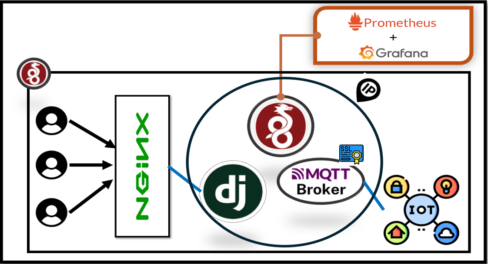
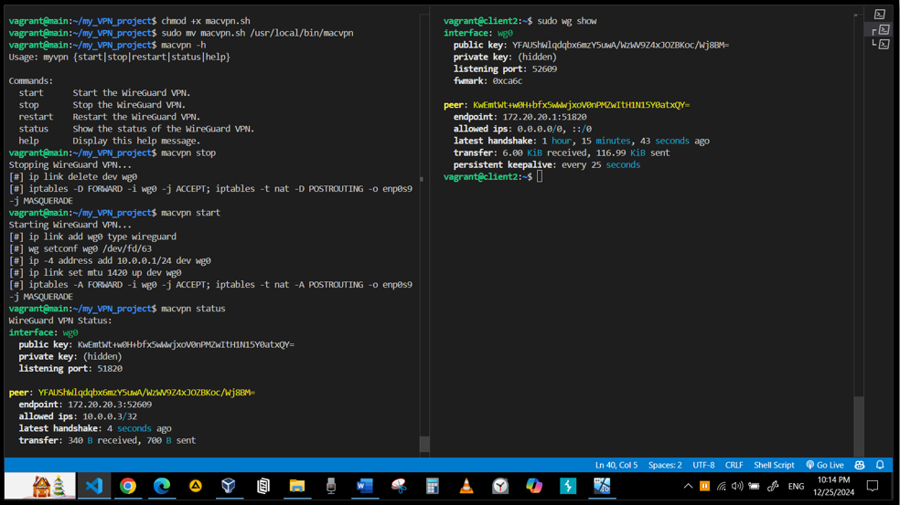
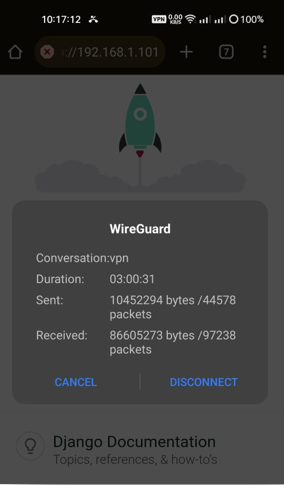
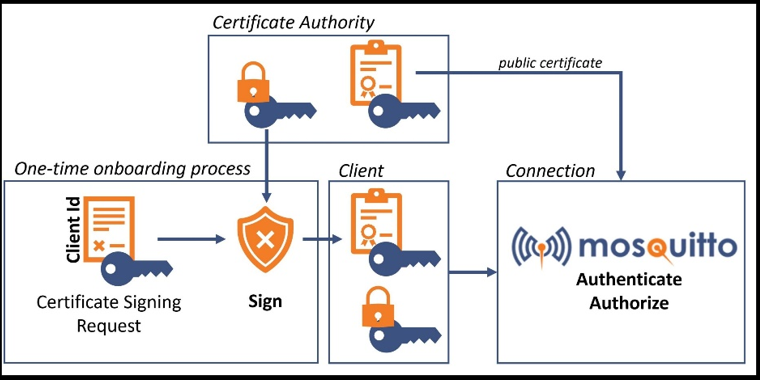
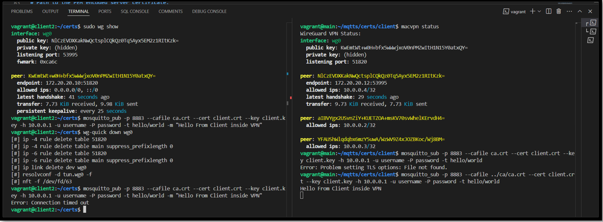
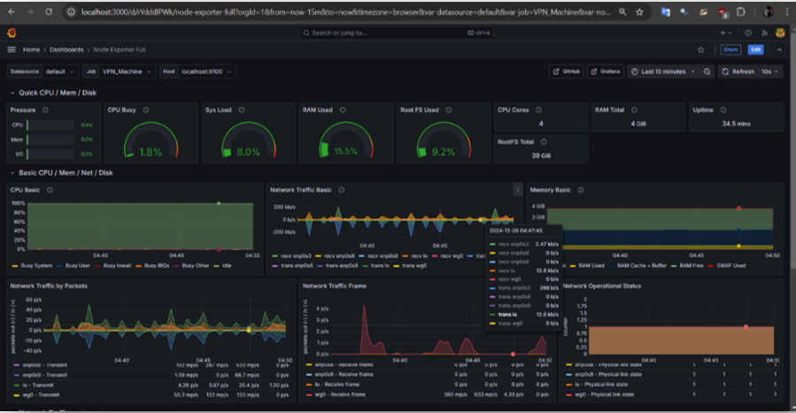
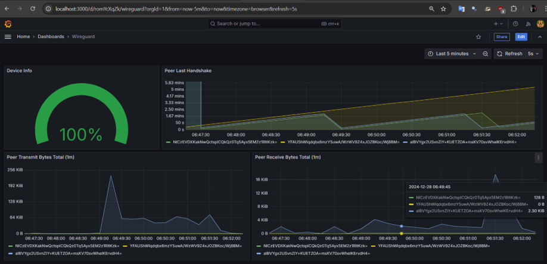

# Project 

This project creates a secure and scalable communication system using WireGuard VPN, a Django backend, and MQTT for IoT communication. WireGuard secures the network, with the Django server and Mosquitto MQTT broker bound to it. Encrypted communication is ensured through certificates signed by a custom CA. Nginx acts as a reverse proxy, allowing only VPN-connected clients. Monitoring is handled with Prometheus and Grafana, while a Bash script simplifies VPN client management. This setup ensures reliable and secure communication for IoT devices and Web/mobile applications.
## Table of Contents

1. [Setup Work Environment](#setup-work-environment)
2. [WireGuard VPN](#wireguard-vpn)  
3. [MQTTS Server with TLS/SSL](#mqtts-server-with-tlsssl)  
4. [Monitoring](#monitoring)  

## System Architecture and Design


## Setup Work Environment

- Use the following commands with the provided `Vagrantfile` to create and manage three virtual machines (VMs):
    - I set up three VMs for the purpose of simulation and testing:

        - Server VM: Hosts the main server components.
        - IoT Device VM: Simulates IoT device interactions.
        - Client VM: Represents a regular user client.

```bash
vagrant init
vagrant up
vagrant ssh main
vagrant ssh client
```

## WireGuard VPN
- Installing WireGuard, resolvconf
- Genrate Public & Private Key pairs
- Configuring the WireGuard
- Verifing 

### Main "Wireguard Server"

#### Installation & Genrate Key pair
``` cmd
sudo apt install wireguard -y
wg genkey > privatekey
cat privatekey | wg pubkey > publickey
```
#### Server Configuration
- Replace server-prikey, Client-pubKey network-interface
``` bash
sudo nano /etc/wireguard/wg0.conf

[Interface]
PrivateKey = <contents-of-server-privatekey>
Address = 10.0.0.1/24
PostUp = iptables -A FORWARD -i wg0 -j ACCEPT; iptables -t nat -A POSTROUTING -o <Your-default-network-interface> -j MASQUERADE
PostDown = iptables -D FORWARD -i wg0 -j ACCEPT; iptables -t nat -D POSTROUTING -o <Your-default-network-interface> -j MASQUERADE
ListenPort = 51820

[Peer]
PublicKey = <contents-of-client-publickey>
AllowedIPs = 10.0.0.2/32

```
- To get your default network interface name, see the output and the name after "dev"
``` bash
ip route list default
```
#### Start and Verify WireGuard Interface
```bash
wg-quick up wg0
sudo wg show
# these lines to To enable WireGuard to start automatically at system boot
# sudo systemctl enable wg-quick@wg0
# sudo systemctl start wg-quick@wg0
# sudo systemctl status wg-quick@wg0
```

#### Forward Traffic to the Internet
``` bash
sudo nano /etc/sysctl.conf
```
- Uncomment this "net.ipv4.ip_forward=1" and apply changes by this:
``` bash
sudo sysctl -p

```

### Clients "Peers"

#### Installation & Genrate Key pair
``` bash
sudo apt install wireguard -y
wg genkey > privatekey
cat privatekey | wg pubkey > publickey
```
#### Peer Configuration
- replace server-pubkey, Client-priKey and Server-IP

``` bash
sudo nano /etc/wireguard/wg0.conf

[Interface]
Address = 10.0.0.2/32
PrivateKey = <contents-of-client-privatekey>
DNS = 1.1.1.1

[Peer]
PublicKey = <contents-of-server-publickey>
Endpoint = <server-accessable-ip>:51820
AllowedIPs = 0.0.0.0/0, ::/0
PersistentKeepalive = 25 
```
#### Start and Verify WireGuard Interface
``` bash
sudo wg-quick up wg0
# sudo systemctl start wg-quick@wg0
# sudo systemctl status wg-quick@wg0
```

#### For Disconnection
```bash
sudo wg-quick down wg0
# sudo systemctl stop wg-quick@wg0
```

### For automating Client creation in this VPN
- Run ./VPN_Client_Gen.sh
- send the created Client_config.sh to the client
- Run the Client_config.sh on the client after giving permissions and run in root mode

### For easy to use vpn
- We will add bash script to make it easier to use this vpn.

``` bash 
# write the content of the myvpn into the file 
sudo nano /usr/local/bin/myvpn
# or use this
sudo cp myvpn /usr/local/bin/myvpn
# Make the file Executable
sudo chmod +x /usr/local/bin/myvpn
```
- You can use this script like this:
``` bash 
myvpn start
myvpn status
myvpn stop
myvpn restart
```





## MQTTS Server with TLS/SSL

### Steps
1. Install MQTT server and client.
2. Create CA certificate and private key.
3. Create broker and clients' private keys and certificates signed by the CA.
4. Configure the broker to bind with the VPN IP on port 8883.
5. Enable username and password authentication for added security.
6. Test the setup.

---

### Server Installation
```bash
sudo apt install mosquitto mosquitto-clients

sudo cp mosquitto.conf /etc/mosquitto/mosquitto.conf

sudo mosquitto_passwd -c /etc/mosquitto/passwords username

sudo systemctl restart mosquitto

```

### Creating CA Certificates

Follow this guide: [Creating CA Certificates](https://openest.io/services/mqtts-how-to-use-mqtt-with-tls/ )

```bash
sudo cp certs/* /etc/mosquitto/certs/
sudo chown -R mosquitto:mosquitto /etc/mosquitto/certs/
```




### Test from Another Machine
``` bash
mosquitto_pub -p 8883 --cafile ca.crt --cert client.crt --key client.key -h 10.0.0.1 -u username -P password -t hello/world -m "Hello From Client inside VPN"
mosquitto_sub -p 8883 --cafile ../ca/ca.crt --cert client.crt --key client.key -h 10.0.0.1 -u username -P password -t hello/world

```

## Monitoring

- Follow this guide: [Prometheus](https://medium.com/@abdullah.eid.2604/prometheus-installation-on-linux-ubuntu-c4497e5154f6)
- Follow this guide: [Grafana](https://grafana.com/docs/grafana/latest/installation/)
- Follow this guide: [Node_exporter](https://medium.com/@abdullah.eid.2604/node-exporter-installation-on-linux-ubuntu-8203d033f69c)
- Follow this guide: [Wiregurad_exporter](https://github.com/mdlayher/wireguard_exporter.git)

---


---


